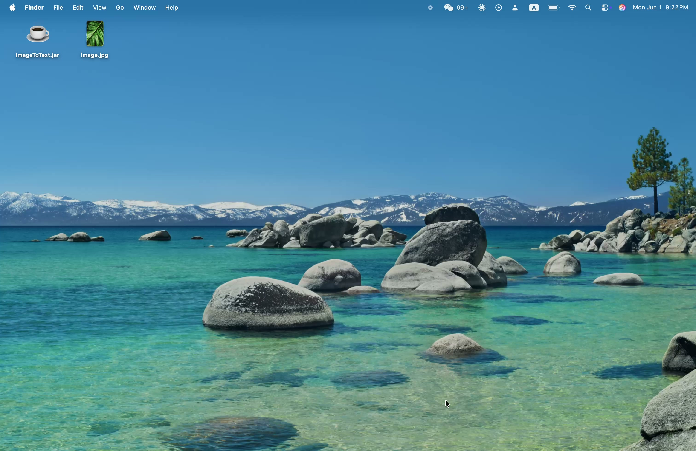

# Image to ASCII Art Converter

A desktop **Java** application that converts raster images into ASCII art in real time. Built from scratch with a fully custom Swing GUI, an off-screen rendering pipeline for O(1) scroll/zoom, background processing via `SwingWorker`, and smooth zoom/pan interaction.

[](https://youtu.be/wKVpjcZxiz4)

## Overview

The app takes any JPG, PNG, or GIF image, converts each pixel to a grayscale luminance value using the Rec. 601 standard, and maps it to one of 70 ASCII characters ordered by visual density (Paul Bourke gradient). The result is rendered into a scrollable, zoomable panel and the intermediate grayscale image is saved to disk automatically.

## Features

| Feature | Details |
|---|---|
| ASCII conversion | 70-character Paul Bourke gradient, Rec. 601 luma |
| Zoom | Buttons, Ctrl+scroll, Ctrl+=/- keyboard shortcuts |
| Pan | Click+drag, arrow keys, two-finger trackpad scroll |
| Fit to window | Auto on load, Fit button, Ctrl+0 |
| Scale | 0.1–1.0 downscale before conversion |
| Grayscale export | Saved alongside source image automatically |
| Performance | O(1) scroll/zoom via pre-rendered buffer |
| Concurrency | SwingWorker — UI stays responsive during processing |

## How It Works

Conversion reads pixels directly from a `BufferedImage` (`getRGB`), computes per-pixel luminance with the Rec. 601 luma coefficients (`0.299R + 0.587G + 0.114B`), and maps each value through a static lookup table to one of 70 density-ordered ASCII characters. The hot pixel loop uses a `StringBuilder` for O(n) assembly, and the whole conversion runs on a `SwingWorker` so the UI never blocks.

The rendered ASCII is drawn once into an off-screen buffer, so scrolling and zooming stay O(1) regardless of image size — nearest-neighbor interpolation keeps it crisp when zoomed in, bilinear keeps it smooth when zoomed out. Interaction is handled with a `MouseAdapter` for drag-to-pan (using screen coordinates for stable deltas) and `getPreciseWheelRotation` for smooth Ctrl+scroll zoom, with an `InputMap`/`ActionMap` shortcut system scoped to the focused window.

## Skills Demonstrated

- Swing GUI from scratch — custom layouts, components, and event handling
- Multithreading & concurrency — `SwingWorker` keeps the UI responsive during conversion
- Off-screen rendering — pre-rendered `BufferedImage` makes scroll and zoom O(1) at any image size
- Image processing — pixel-level RGB manipulation via `getRGB` / `setRGB`
- Grayscale conversion — Rec. 601 luma coefficients (`0.299R + 0.587G + 0.114B`)
- Algorithm/data-structure use — static lookup table for the brightness → character mapping
- Image scaling — `SCALE_SMOOTH` downscaling with zoom-aware nearest-neighbor / bilinear interpolation
- Keyboard shortcut system — `InputMap` / `ActionMap` with `WHEN_IN_FOCUSED_WINDOW` scope
- Performance optimization — `StringBuilder` over concatenation in hot pixel loops for O(n)
- Pan & zoom UX — drag-to-pan, precise Ctrl+scroll zoom, and fit-to-window on every transform
- Layout management — responsive nested `BorderLayout` so zoom controls stay visible at any width
- Error handling — `IOException` propagation with user-facing dialogs, no silent failures
- Object-oriented design — separate converter, text panel, and prompt components
- JAR packaging — distributed as a standalone runnable JAR

## Tech Stack

- Java 17+
- Java Swing / AWT (`BufferedImage`, `Graphics2D`, `SwingWorker`, `InputMap` / `ActionMap`, `MouseAdapter`)
- Packaged as a standalone runnable JAR (`ImageToText.jar`)

## Getting Started

```sh
java -jar ImageToText.jar
```

Requires Java 17 or later.

1. Browse to or paste an image path (JPG, PNG, GIF)
2. Set a scale factor (default 1.0 — lower for denser output)
3. Click **Transform**
4. Zoom with `Ctrl`+scroll or `+`/`−`, pan by dragging or using arrow keys
